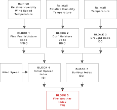

# Saptial Temporal Analysis of Bushfire - Metrological Data


## Introduction:
_______
2020 has been highly unpredictable interms the even that has been happening recently. One such unfortunate event was the bushfire that happened around the world this year. Especially the one that has happened in Australia which almost enveloped most part of Australia leaving a lot of damage behind interms of livelyhood, vegetation loss and lives lost. Though there were a lot of firefighter that were tasked at bringing the fire under controls they could at best mitigate the damages of the fires than to completely stop it which was due to the vastness of the problem. The fire in Australia was majorly caused due climatic changes and in general the earth becoming hotter. We can say that there would be more such bushfire to be expected around the world and in Austrlia.

What this project aims at achieving is to effectively predict bushfire in the future in terms of its __location (Spatial)__ also __time (temporal)__ and the area of affect. This project is based on another research paper which was conducted for the Eurpean bushfires

## Technicalites:
------
### R 4.0.0

### Libraries:
    * grid
    * lattice
    * gridExtra
    * GGaly
    * tidyverse
    * psych
    * reshape
    * corrplot
    * caret
    * ranger
    * e1071
### Pre-settings:
The options was get to -1 so as to not show the warning that can come due to discrepancy between libraries or warnings generated due to depreceation of some functions in libraries that we might not be using this is completely _optional_.
```r
options(warn=-1)
set.seed(137) #137 is the golden quantum number (a lil nerd)
```


## Preliminary :
-----------
 This project tasks us with the responsiblity of completeing an Exploratory Data Analysis and consequently building a Model from the selected features to accurately predict the area of the forest fires using some predictors variables like (FFMC, ISI, rain, DMC, DC, temp, wind, month, day)
There for what we are trying to do is create a model that minizes the rss or maximizes r2 values for model where:
* X dependent = FFMC, ISI, rain, DMC, DC, RH, temp, wind, month, day
* Y indipendent = Area (continous variable)

## Variables:
---
There are are in total 10 variables some of the variables are self explanatory while other like DMC FFMC ISI DC have a need to be explained. These wariable are collected by any metrological departement to calcilate the Fire Weather Index (FWI) to better explain there is a diagram that is attached and also a link provided.



(Img scr: [euemtrain](http://www.eumetrain.org/data/3/30/navmenu.php?tab=3&page=6.0.0 "Forest Fires"))


## Models:
---
In this assignment we where given Forest Fire Dataset that had been accumulated from portugal. In the paper that did the intial analysis of the Dataset they had mentioned the sporadic way the data had been collected. Looking at the incosistency with the data i choose to implement 3 models:

  * Linear Regression with Subset selection 
  * Random Forrest Regression
  * Support Vector Regressor
    
The reason for not choosing these variables where due to the reason that the number of Dataset values was very less and the number of predictors where much more less than the 30 therefore directly choosing a subset to fit the modle seemed the best linear regression method. The method where also implemented on this book and later on removed due to the very low R-squared value and high MAE.


There were three models that were used ju
## Results
---
| Models        | MAE           | RMSE  |
| ------------- |:-------------:| -----:|
| Linear Regressor + L2    | 5.580 | 174.028 |
| Random Forest Regressor     | 5.537      |   174.462 |
| Support Vector Regressor | 6.504|    188.2246 |

## Refrences :
---
1. Is R-squared Useless? (https://data.library.virginia.edu/is-r-squared-useless/)
2. Bushfire Weather (http://www.bom.gov.au/weather-services/fire-weather-centre/bushfire-weather/index.shtml)
3. Seasonal Rainfall in portugal (https://en.climate-data.org/europe/portugal-250/)
4. SperatingtheBimodaldistribution(https://stats.stackexchange.com/questions/26876separating-the-populations-in-a-bimodal-distribution)
5. Forest Weather indext (http://www.eumetrain.org/data/3/30/navmenu.php?tab=3&page=6.0.0 )